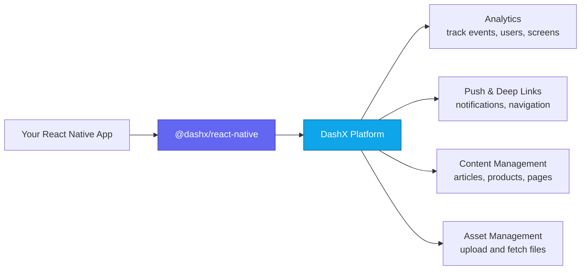
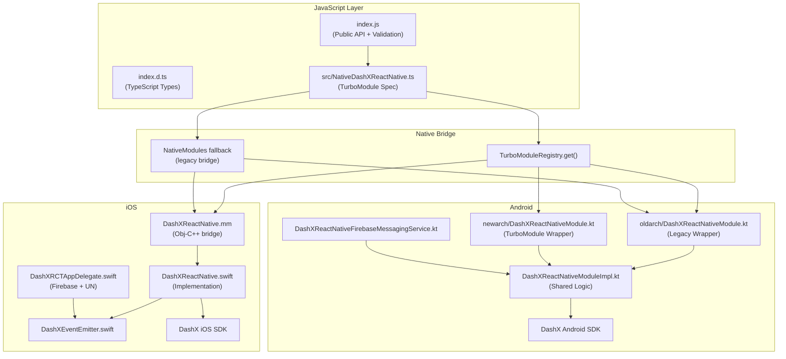
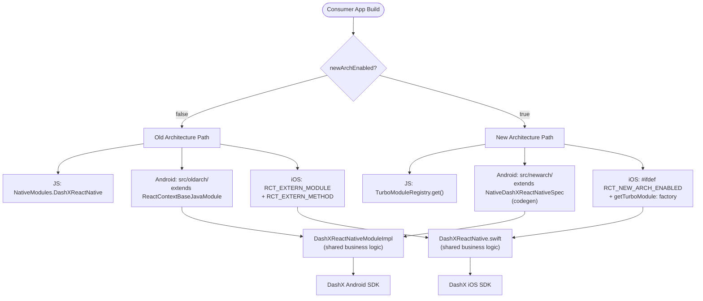
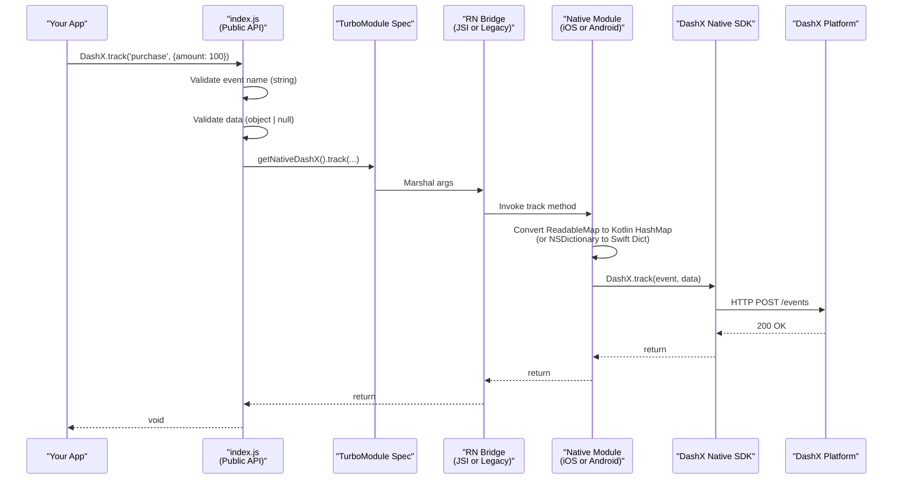
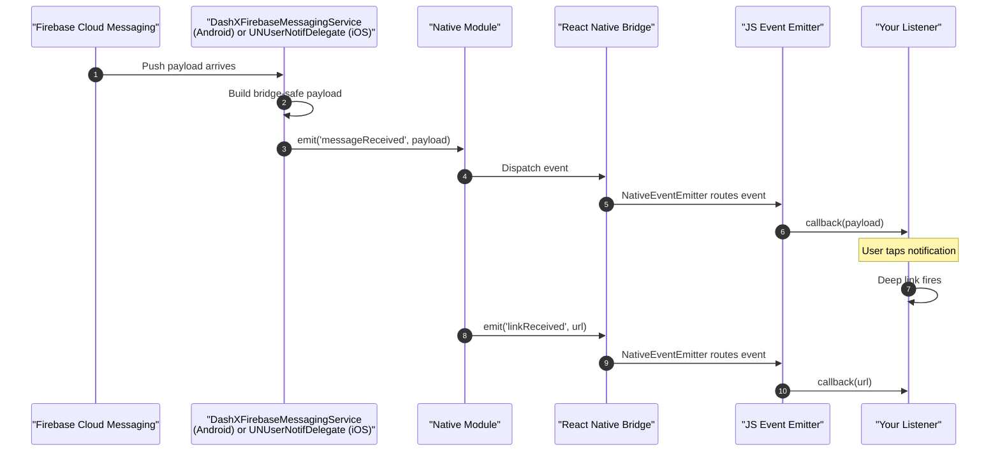
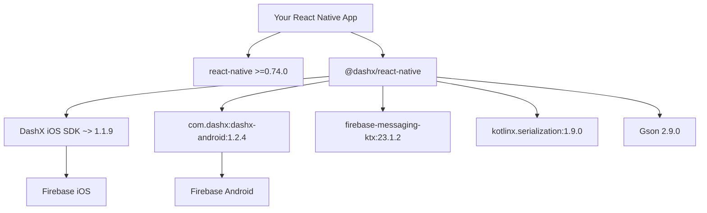
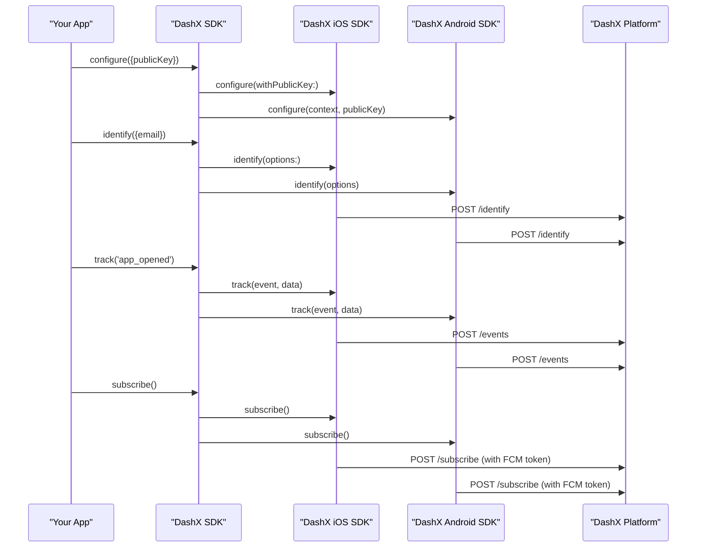

<div align="center">

<a href="https://dashx.com"></a>

<p><strong>The official DashX SDK for React Native</strong><br/>
<sub>Analytics · Content Management · Push Notifications · Deep Linking · Asset Management</sub></p>

<p>
  <a href="https://www.npmjs.com/package/@dashx/react-native"></a>
  <a href="https://www.npmjs.com/package/@dashx/react-native"></a>
  <a href="https://github.com/dashxhq/dashx-react-native/blob/main/LICENSE"></a>
  <a href="#installation"></a>
  
  
  
  
</p>

<p>
  <a href="https://dashx.com">Website</a>
  &nbsp;·&nbsp;
  <a href="https://docs.dashx.com">Documentation</a>
  &nbsp;·&nbsp;
  <a href="https://docs.dashx.com/sdks/client-side/react-native-sdk">React Native SDK Docs</a>
</p>

</div>


## Table of Contents

- [Overview](#overview)
- [Features](#features)
- [Architecture](#architecture)
  - [High-Level Architecture](#high-level-architecture)
  - [Dual-Architecture Support](#dual-architecture-support)
  - [Method Call Lifecycle](#method-call-lifecycle)
  - [Event Flow — Push Notifications & Deep Links](#event-flow--push-notifications--deep-links)
- [Requirements](#requirements)
- [Installation](#installation)
  - [Manual Installation](#manual-installation)
  - [AI Agent Installation](#ai-agent-installation)
- [Quick Start](#quick-start)
- [API Surface](#api-surface)
- [Cross-Platform Feature Matrix](#cross-platform-feature-matrix)
- [TypeScript Support](#typescript-support)
- [Deep Linking & Push Navigation](#deep-linking--push-navigation)
- [iOS: Handle notifications from a custom AppDelegate (e.g. Expo)](#ios-handle-notifications-from-a-custom-appdelegate-eg-expo)
- [Android: Notification channels](#android-notification-channels)
- [Troubleshooting](#troubleshooting)
- [Versioning & Breaking Changes](#versioning--breaking-changes)
- [Contributing](#contributing)
- [License](#license)


## Overview

`@dashx/react-native` is a thin, strongly-typed JavaScript facade over the native **[DashX iOS SDK](https://github.com/dashxhq/dashx-ios)** and **[DashX Android SDK](https://github.com/dashxhq/dashx-android)**. It gives your React Native app a single, consistent way to:

- **Identify** users and track their behavior across sessions.
- **Track events and screen views** with structured metadata.
- **Deliver push notifications** via Firebase Cloud Messaging on both platforms.
- **Handle deep links** (universal links on iOS, app links on Android) with structured navigation actions.
- **Fetch CMS content** by URN or via full-text / filter-based search.
- **Upload and fetch assets** (images, video) tied to your DashX records.
- **Manage user notification preferences** with a persistent, promise-based API.

All without writing a single line of platform-specific code in your app.



---

## Features

| Category | Capabilities |
|---|---|
| 🧭 **Identity** | `configure`, `identify`, `setIdentity`, `reset` |
| 📊 **Analytics** | `track`, `screen`, event metadata, session tracking |
| 📝 **Content Management** | `fetchRecord`, `searchRecords` with filter, order, pagination, preview |
| ⚙️ **Preferences** | `fetchStoredPreferences`, `saveStoredPreferences` |
| 🔔 **Push Notifications** | `subscribe`, `unsubscribe`, `requestNotificationPermission`, `getNotificationPermissionStatus`, `onMessageReceived` |
| 🔗 **Deep Links** | `processURL`, `trackNotificationNavigation`, `onLinkReceived` |
| 🖼️ **Assets** | `uploadAsset`, `fetchAsset` |
| 🔧 **Diagnostics** | `setLogLevel` (off / error / debug) |
| 🍎 **iOS-only** | `enableLifecycleTracking`, `enableAdTracking` (ATT) |

---

## Architecture

### High-Level Architecture

The SDK uses an **Impl + thin wrappers** pattern so that a single codebase supports both React Native's legacy bridge and the New Architecture's TurboModule system — without runtime branching and without duplicating business logic.



### Dual-Architecture Support

Starting with **1.2.0**, `@dashx/react-native` is a **TurboModule** and supports both React Native architectures out of the box from a single install. The right wrapper is selected **at compile time** — no runtime branching, no consumer-side flags to flip beyond the standard RN `newArchEnabled` setting.



**Why this matters:**

- ✅ **Same install, same API** — drop in `@dashx/react-native` once, works on both architectures.
- ✅ **Zero runtime branching** — the right code path is picked at build time by Gradle source sets (Android) and `#ifdef` (iOS).
- ✅ **No JS-side platform checks** — `TurboModuleRegistry.get()` auto-falls back to `NativeModules` on old arch.
- ✅ **Single source of truth** — business logic lives in one place per platform (`DashXReactNativeModuleImpl.kt` on Android, `DashXReactNative.swift` on iOS). The old-arch and new-arch wrappers are thin delegates.

### Method Call Lifecycle

Here's what happens when you call a method like `DashX.track('purchase', { amount: 100 })`:



**Key validation layers:**

1. **JavaScript layer** performs input validation (type checks, required fields) before touching the bridge. Invalid calls throw immediately without ever reaching native code.
2. **Native layer** handles the heavy lifting (JSON serialization, type conversion, SDK invocation).
3. **Platform gating** — iOS-only methods (`enableLifecycleTracking`, `processURL`, `trackNotificationNavigation`, `enableAdTracking`) early-return on Android at the JS layer. Android parity gaps (`uploadAsset`, `fetchAsset`, `requestNotificationPermission`, `getNotificationPermissionStatus`) reject with `EUNSUPPORTED`.

### Event Flow — Push Notifications & Deep Links

The SDK bridges native event sources (FCM on Android, Firebase + `UNUserNotificationCenter` on iOS) to JavaScript via a shared event-emitter pattern. You subscribe with `onMessageReceived` / `onLinkReceived` and get a standard `EmitterSubscription` back.



**Usage:**

```ts
import DashX from '@dashx/react-native';

const messageSub = DashX.onMessageReceived((message) => {
  console.log('Push received:', message);
});

const linkSub = DashX.onLinkReceived((url) => {
  console.log('Deep link:', url);
});

// Remember to clean up on unmount
messageSub.remove();
linkSub.remove();
```


## Requirements

Before installing, make sure your project meets the following requirements:

| Requirement | Minimum | Recommended |
|---|---|---|
| **React Native** | 0.74.0 | 0.75+ |
| **React** | 17.0.0 | 18.x |
| **iOS Deployment Target** | 13.0 | 15.0+ |
| **Android `minSdkVersion`** | 26 | 26+ |
| **Android `compileSdkVersion`** | 34 | 34+ |
| **Node.js** | 16 | 18 LTS or newer |
| **Xcode** | 14 | 15+ |
| **Kotlin** | 1.8 | 1.9+ |

> [!WARNING]
> **Expo Go is not supported** because this SDK has native modules that need to be compiled into the app binary. **Regular Expo projects are fine** as long as you use a [development build](https://docs.expo.dev/develop/development-builds/introduction/) instead of the Expo Go app. If you're already running `npx expo run:ios` / `npx expo run:android` (or have `ios/` and `android/` folders at the project root), you're on a development build and this SDK works out of the box.

> [!NOTE]
> From **1.2.0** the minimum supported React Native version is **0.74.0** (previously 0.71.0). TurboModule codegen matured in 0.74 — earlier versions have edge cases with `BaseReactPackage` and iOS Swift interop that are not worth supporting.


## Installation

Pick the path that fits how you work:

| Path | Who it's for | Effort |
|---|---|---|
| 🛠️ **[Manual Installation](#manual-installation)** | Developers who want to run each step themselves and understand what's happening | ~10 minutes |
| 🤖 **[AI Agent Installation](#ai-agent-installation)** | Developers using Claude Code, Cursor, Copilot, Windsurf, or any AI coding assistant — copy a single prompt and let the agent do the whole setup end-to-end | ~2 minutes |

Both paths produce the same result — pick whichever you prefer.

---

### Manual Installation

🛠️ Run each step yourself in your project root.

#### 1. Install the package

Pick your package manager:

```sh
# npm
npm install @dashx/react-native

# yarn
yarn add @dashx/react-native

# pnpm
pnpm add @dashx/react-native
```

#### 2. Install iOS dependencies

```sh
cd ios && pod install && cd ..
```

If you are migrating an existing project to the New Architecture, also run:

```sh
cd ios && RCT_NEW_ARCH_ENABLED=1 pod install && cd ..
```

#### 3. Configure Firebase (required for push notifications)

Push notifications use Firebase Cloud Messaging on both platforms. Follow the standard Firebase setup:

- **iOS** — add `GoogleService-Info.plist` to your Xcode project.
- **Android** — add `google-services.json` to `android/app/` and ensure the Google Services Gradle plugin is applied.

See the [Firebase documentation](https://firebase.google.com/docs/cloud-messaging) for platform-specific details.

#### 4. Enable New Architecture (optional)

If you want to opt into the New Architecture / TurboModule path:

- **Android** — in `android/gradle.properties`:
  ```properties
  newArchEnabled=true
  ```
- **iOS** — run `pod install` with `RCT_NEW_ARCH_ENABLED=1`:
  ```sh
  cd ios && RCT_NEW_ARCH_ENABLED=1 pod install
  ```

**That's it.** The same `@dashx/react-native` package and the same JavaScript API work on both architectures — no code changes in your app.

#### 5. Initialize the SDK in your app entry file

Call `DashX.configure()` once, as early as possible — ideally in your root component's `useEffect` or in `index.js` before `AppRegistry.registerComponent`.

```ts
import DashX from '@dashx/react-native';

DashX.configure({
  publicKey: 'YOUR_DASHX_PUBLIC_KEY',
});
```

#### 6. Rebuild your app

```sh
# iOS
npx react-native run-ios

# Android
npx react-native run-android
```

---

### AI Agent Installation

🤖 If you use an AI coding assistant (Claude Code, Cursor, GitHub Copilot, Windsurf, Cline, Aider, etc.), hand off the entire installation to the agent. **Copy the prompt below, paste it into your agent, and it will perform every step end-to-end in your project.**

The prompt is self-contained — it tells the agent what to install, where to put things, what to verify, and what to do if something fails. You only need to provide your **DashX public key** when asked.

#### 📋 Copy this prompt into your AI agent

<details>
<summary><strong>📖 Click to expand the full AI agent prompt (hover the expanded code block to reveal the copy button)</strong></summary>

```text
You are installing and integrating `@dashx/react-native` (v1.2.0+) into this React Native project. Perform every step below in order. Do not skip verification steps. If any step fails, report the error clearly and wait for my decision before continuing.

================================================================
CONTEXT
================================================================

`@dashx/react-native` is the official DashX SDK for React Native. It's a TurboModule that works on both React Native's Old Architecture and New Architecture from a single install. It provides analytics, content management, push notifications, deep linking, and asset management — all backed by native iOS and Android SDKs.

- npm package: @dashx/react-native
- Minimum React Native: 0.74.0
- Minimum iOS deployment target: 13.0
- Minimum Android minSdkVersion: 26
- Requires Firebase Cloud Messaging for push notifications
- NOT compatible with Expo Go — if this is an Expo project, the user must be using a development build

================================================================
STEP 1 — VERIFY PREREQUISITES
================================================================

Before installing, verify the project meets all requirements:

1. Read package.json and confirm react-native version is >=0.74.0.
   - If lower, STOP and report — the user needs to upgrade React Native first.

2. Confirm this is NOT an Expo Go project:
   - If app.json / app.config.js exists and the project uses Expo, confirm a development build is in use (check for expo-dev-client in dependencies, or prebuild output in ios/ and android/ directories).
   - If it's pure Expo Go, STOP and tell the user they must migrate to a development build first.

3. Read ios/Podfile and confirm platform :ios, '13.0' or higher.

4. Read android/build.gradle (project-level) and confirm minSdkVersion = 26 or higher.

5. Detect the package manager:
   - yarn.lock exists → use yarn
   - pnpm-lock.yaml exists → use pnpm
   - otherwise → use npm

6. Detect whether the project uses New Architecture:
   - Check android/gradle.properties for newArchEnabled=true
   - Check ios/Podfile for RCT_NEW_ARCH_ENABLED=1 env usage

Report the detected values back to me and wait for confirmation before continuing.

================================================================
STEP 2 — INSTALL THE PACKAGE
================================================================

Install @dashx/react-native using the detected package manager. Do NOT use a different package manager than the one the project already uses — that will corrupt the lockfile.

  npm install @dashx/react-native
  yarn add @dashx/react-native
  pnpm add @dashx/react-native

================================================================
STEP 3 — INSTALL iOS PODS
================================================================

From the project root:

  cd ios && pod install && cd ..

If New Architecture was detected in Step 1:

  cd ios && RCT_NEW_ARCH_ENABLED=1 pod install && cd ..

Verify the pod was installed by checking that ios/Pods/DashX/ and related DashX-prefixed directories exist under ios/Pods/. If the pod install fails with a message about DashX iOS SDK not being found, DashXReactNative.podspec depends on pod 'DashX', '~> 1.1.9' — make sure CocoaPods can reach the spec repo (pod repo update may help).

================================================================
STEP 4 — VERIFY FIREBASE IS CONFIGURED
================================================================

The SDK's push notification feature requires Firebase Cloud Messaging on both platforms. Check:

iOS:
- File ios/<AppName>/GoogleService-Info.plist exists.
- The file is added to the Xcode project target.

Android:
- File android/app/google-services.json exists.
- android/build.gradle (project-level) has the Google Services classpath: classpath 'com.google.gms:google-services:4.x.x' (or newer).
- android/app/build.gradle has apply plugin: 'com.google.gms.google-services' at the bottom.

If Firebase is NOT configured, do NOT try to set it up yourself — STOP and tell the user:
  "Firebase Cloud Messaging is not configured in this project. Please follow https://firebase.google.com/docs/cloud-messaging to add GoogleService-Info.plist (iOS) and google-services.json (Android), then re-run this installation."

If Firebase IS configured, continue.

================================================================
STEP 5 — INITIALIZE THE SDK IN THE APP ENTRY FILE
================================================================

Find the app's entry file. Look for these in order:
  1. App.tsx or App.jsx at the project root
  2. src/App.tsx or src/App.jsx
  3. index.js at the project root

In the entry file:

1. Add the import at the top with the other imports:

     import DashX from '@dashx/react-native';

2. Call DashX.configure() once, as early as possible in the app lifecycle. The recommended pattern is inside a useEffect with an empty dependency array in the root component:

     import React, { useEffect } from 'react';
     import DashX from '@dashx/react-native';

     export default function App() {
       useEffect(() => {
         DashX.configure({
           publicKey: 'YOUR_DASHX_PUBLIC_KEY',
           // Optional:
           // baseURI: 'https://your-self-hosted-dashx.com',
           // targetEnvironment: 'staging',
         });
       }, []);

       return /* existing return */;
     }

3. Do NOT hardcode the public key. If the project has an env-loading library (react-native-config, react-native-dotenv, @env, or process.env via Babel plugin), use that. Otherwise, ask the user for the public key and add a TODO comment explaining where to put it securely. NEVER commit a real public key to git.

4. If the user has no env setup, add the key as a placeholder literal ('YOUR_DASHX_PUBLIC_KEY') and tell the user to replace it before running.

================================================================
STEP 6 — WIRE UP PUSH & DEEP LINK LISTENERS (ASK FIRST)
================================================================

Ask the user: "Do you want me to wire up push notification and deep link listeners now? (yes/no)"

If yes, add listener setup and cleanup inside the same useEffect:

  useEffect(() => {
    DashX.configure({ publicKey: 'YOUR_DASHX_PUBLIC_KEY' });

    DashX.subscribe(); // register device for push

    const messageSub = DashX.onMessageReceived((message) => {
      console.log('[DashX] Push received:', message);
    });

    const linkSub = DashX.onLinkReceived((url) => {
      console.log('[DashX] Deep link:', url);
    });

    return () => {
      messageSub.remove();
      linkSub.remove();
    };
  }, []);

If no, skip this step.

================================================================
STEP 7 — TYPESCRIPT SETUP (IF APPLICABLE)
================================================================

If the project uses TypeScript (tsconfig.json exists):

1. Verify the @dashx/react-native import resolves without errors. The package ships its own types via index.d.ts — no @types/... package is needed.

2. Run the project's TypeScript check command (usually tsc --noEmit or npm run typecheck / yarn tsc) and confirm there are no new errors introduced by the DashX imports.

================================================================
STEP 8 — CLEAN AND REBUILD
================================================================

Instruct the user to run a clean rebuild. Do NOT try to run the app yourself — just prepare the commands:

  # iOS
  cd ios && pod install && cd ..
  npx react-native run-ios

  # Android
  cd android && ./gradlew clean && cd ..
  npx react-native run-android

================================================================
STEP 9 — VERIFY INSTALLATION
================================================================

After the user reports a successful build:

1. Ask the user to check the device/emulator console for any error messages containing "DashX" or "The package '@dashx/react-native' doesn't seem to be linked".

2. Ask the user to trigger a simple test event to confirm the pipeline works:

     DashX.track('installation_test', { timestamp: Date.now() });

3. Ask the user to confirm the event shows up in the DashX dashboard under Events within a minute or two.

If any step fails, consult the Troubleshooting section of the @dashx/react-native README or ask the user to run with DashX.setLogLevel(2) (debug mode) and share the logs.

================================================================
RULES — STRICTLY ENFORCE
================================================================

DO NOT:
- Edit yarn.lock / package-lock.json / pnpm-lock.yaml by hand. Let the package manager handle them.
- Run pod install on a project that uses Expo Go (non-dev-build).
- Commit real secrets (public keys, tokens) to the repo.
- Downgrade React Native, iOS deployment target, or Android minSdkVersion. If the project doesn't meet the requirements, STOP and report.
- Skip Step 1 (prerequisite verification).
- Install a different DashX package. The package name is exactly @dashx/react-native.

DO:
- Use the project's existing package manager.
- Preserve the user's existing code and imports when modifying the entry file.
- Add a TODO comment next to the public key placeholder if no env setup exists.
- Report what you did at each step so the user can verify.

Begin with Step 1.
```

</details>

---

### Dependency tree

Whichever path you pick, here's what ends up in your project after installation:



---

## Quick Start

A minimal working integration:

```ts
import React, { useEffect } from 'react';
import DashX from '@dashx/react-native';

export default function App() {
  useEffect(() => {
    // 1. Initialize the SDK (do this once, as early as possible)
    DashX.configure({
      publicKey: 'YOUR_DASHX_PUBLIC_KEY',
      // Optional overrides:
      // baseURI: 'https://your-self-hosted-dashx.com',
      // targetEnvironment: 'staging',
    });

    // 2. Identify the current user (when you have one)
    DashX.identify({
      firstName: 'Jane',
      lastName: 'Doe',
      email: 'jane@example.com',
    });

    // 3. Track an event
    DashX.track('app_opened', { source: 'cold_start' });

    // 4. Subscribe to push notifications
    DashX.subscribe();

    // 5. Listen for messages and deep links
    const msgSub = DashX.onMessageReceived((msg) => {
      console.log('Push:', msg);
    });
    const linkSub = DashX.onLinkReceived((url) => {
      console.log('Link:', url);
    });

    return () => {
      msgSub.remove();
      linkSub.remove();
    };
  }, []);

  return null;
}
```

### What happens behind the scenes



---

## API Surface

The SDK exposes **21 methods** plus **2 event listeners**, grouped by concern.

### Identity & Session

| Method | Description | Returns |
|---|---|---|
| `configure(options)` | Initialize the SDK with your public key. Call as early as possible. | `void` |
| `identify(options)` | Identify the current user with traits (name, email, phone, etc.). | `void` |
| `setIdentity(uid, token)` | Set user identity using a UID and auth token. | `void` |
| `reset()` | Clear current user identity and SDK state (e.g., on logout). | `void` |

### Analytics

| Method | Description | Returns |
|---|---|---|
| `track(event, data?)` | Track a named event with optional metadata. | `void` |
| `screen(name, data?)` | Track a screen view with optional metadata. | `void` |

### Content Management

| Method | Description | Returns |
|---|---|---|
| `fetchRecord(urn, options?)` | Fetch a single record by URN (e.g. `"article/123"`). Supports `preview`, `language`, `fields`, `include`, `exclude`. | `Promise<Record>` |
| `searchRecords(resource, options?)` | Search records by resource. Supports `filter`, `order`, `limit`, `page`, `preview`, `language`, `fields`, `include`, `exclude`. | `Promise<Record[]>` |

### Preferences

| Method | Description | Returns |
|---|---|---|
| `fetchStoredPreferences()` | Fetch stored notification preferences for the current user. | `Promise<Record>` |
| `saveStoredPreferences(data)` | Save notification preferences for the current user. | `Promise<Record>` |

### Push Notifications

| Method | Description | Returns |
|---|---|---|
| `subscribe()` | Subscribe the current device to push notifications. | `void` |
| `unsubscribe()` | Unsubscribe the current device from push notifications. | `void` |
| `requestNotificationPermission()` | Request push permission from the user. | `Promise<Status>` |
| `getNotificationPermissionStatus()` | Get the current permission status without prompting. | `Promise<Status>` |
| `onMessageReceived(callback)` | Listen for incoming push notifications. | `EmitterSubscription` |

### Deep Links

| Method | Description | Returns |
|---|---|---|
| `processURL(url, options?)` | Track a deep link open event. **iOS only.** | `void` |
| `trackNotificationNavigation(action?, notificationId?)` | Track a notification navigation tap. **iOS only.** | `void` |
| `onLinkReceived(callback)` | Listen for deep link / universal link events. | `EmitterSubscription` |

### Assets

| Method | Description | Returns |
|---|---|---|
| `uploadAsset(filePath, resource, attribute)` | Upload a local file to DashX. | `Promise<AssetResponse>` |
| `fetchAsset(assetId)` | Fetch details of a previously uploaded asset. | `Promise<AssetResponse>` |

### Diagnostics & Platform-Specific

| Method | Description | Returns |
|---|---|---|
| `setLogLevel(level)` | Set SDK log verbosity: `0 = off`, `1 = error`, `2 = debug`. | `void` |
| `enableLifecycleTracking()` | Enable automatic app lifecycle tracking. **iOS only.** | `void` |
| `enableAdTracking()` | Enable IDFA/ATT tracking and request ATT permission. **iOS only.** | `void` |

---

## Cross-Platform Feature Matrix

| Feature | iOS | Android | Notes |
|---|:---:|:---:|---|
| `configure`, `identify`, `setIdentity`, `reset` | ✅ | ✅ | Full parity |
| `track`, `screen` | ✅ | ✅ | Full parity |
| `fetchRecord`, `searchRecords` | ✅ | ✅ | Full parity |
| `fetchStoredPreferences`, `saveStoredPreferences` | ✅ | ✅ | Full parity |
| `subscribe`, `unsubscribe` | ✅ | ✅ | Full parity |
| `setLogLevel` | ✅ | ✅ | Full parity |
| `onMessageReceived`, `onLinkReceived` | ✅ | ✅ | Full parity |
| `requestNotificationPermission` | ✅ | ✅ | Android uses `POST_NOTIFICATIONS` (API 33+); auto-granted on older OS |
| `getNotificationPermissionStatus` | ✅ | ✅ | Returns iOS-compatible status codes on both platforms |
| `uploadAsset`, `fetchAsset` | ✅ | ⏳ | Android stub (`EUNSUPPORTED`); full impl in a future release |
| `enableLifecycleTracking` | ✅ | ➖ | iOS-only, no-op on Android |
| `enableAdTracking` (ATT) | ✅ | ➖ | iOS-only, no-op on Android |
| `processURL` | ✅ | ➖ | iOS-only, no-op on Android |
| `trackNotificationNavigation` | ✅ | ➖ | iOS-only, no-op on Android |

**Legend:** ✅ fully supported · ⏳ stubbed (returns `EUNSUPPORTED`) · ➖ iOS-only, silently no-ops on Android

---

## TypeScript Support

The SDK ships with full TypeScript definitions in [`index.d.ts`](./index.d.ts). You get autocomplete, type-checking, and inline documentation for every method and option.

```ts
import DashX, {
  type ConfigureOptions,
  type IdentifyOptions,
  type FetchRecordOptions,
  type SearchRecordsOptions,
  type NotificationMessage,
  type NavigationAction,
  type NotificationPermissionStatus,
  DashXErrorCode,
} from '@dashx/react-native';

// Strongly-typed configuration
const options: ConfigureOptions = {
  publicKey: 'pk_live_…',
  targetEnvironment: 'production',
};
DashX.configure(options);

// Typed navigation actions
const action: NavigationAction = { type: 'deepLink', url: 'myapp://home' };
DashX.trackNotificationNavigation(action, 'notif-123');

// Typed search options
const results = await DashX.searchRecords('articles', {
  filter: { status: 'published' },
  limit: 10,
  page: 1,
  include: [{ author: {} }],
});
```

---

## Deep Linking & Push Navigation

See the [Deep Linking & Push Navigation guide](https://docs.dashx.com/apps/messaging/deep-linking) on the DashX docs for:

- iOS universal links setup
- Android app links setup
- Handling notification taps
- `NavigationAction` shapes: `deepLink`, `screen`, `richLanding`, `clickAction`
- End-to-end code examples

---

## iOS: Handle notifications from a custom AppDelegate (e.g. Expo)

Apps with a **custom `AppDelegate`** — most notably **Expo apps**, which extend `ExpoAppDelegate` — need to forward remote notifications to `DashXNotificationHandler` so silent pushes are parsed, displayed as local notifications, and tracked.

The helper is a static `@objc` class bundled with the SDK. Expose it to Swift via your app's bridging header, then call it from your `AppDelegate`.

#### 1. Expose the helper through your bridging header

Add the forward declaration to your app's `*-Bridging-Header.h` (Expo projects already have one; create one if your project doesn't):

```objc
#import <UIKit/UIKit.h>
#import <UserNotifications/UserNotifications.h>

@interface DashXNotificationHandler : NSObject
+ (void)handleRemoteNotificationWithUserInfo:(NSDictionary * _Nonnull)userInfo
                           completionHandler:(void (^ _Nonnull)(UIBackgroundFetchResult))completionHandler
    NS_SWIFT_NAME(handleRemoteNotification(userInfo:completionHandler:));
+ (void)handleNotificationResponse:(UNNotificationResponse * _Nonnull)response
    NS_SWIFT_NAME(handleNotificationResponse(_:));
@end
```

#### 2. Call it from your AppDelegate

```swift
import FirebaseCore
import FirebaseMessaging

@UIApplicationMain
public class AppDelegate: ExpoAppDelegate, UNUserNotificationCenterDelegate, MessagingDelegate {

  public override func application(
    _ application: UIApplication,
    didFinishLaunchingWithOptions launchOptions: [UIApplication.LaunchOptionsKey: Any]? = nil
  ) -> Bool {
    FirebaseApp.configure()
    Messaging.messaging().delegate = self
    UNUserNotificationCenter.current().delegate = self

    UNUserNotificationCenter.current().requestAuthorization(options: [.alert, .badge, .sound]) { granted, _ in
      if granted {
        DispatchQueue.main.async { application.registerForRemoteNotifications() }
      }
    }
    return super.application(application, didFinishLaunchingWithOptions: launchOptions)
  }

  public override func application(
    _ application: UIApplication,
    didRegisterForRemoteNotificationsWithDeviceToken deviceToken: Data
  ) {
    Messaging.messaging().apnsToken = deviceToken
  }

  public func messaging(_ messaging: Messaging, didReceiveRegistrationToken fcmToken: String?) {
    guard let token = fcmToken else { return }
    DashX.setFCMToken(to: token)
  }

  public override func application(
    _ application: UIApplication,
    didReceiveRemoteNotification userInfo: [AnyHashable: Any],
    fetchCompletionHandler completionHandler: @escaping (UIBackgroundFetchResult) -> Void
  ) {
    Messaging.messaging().appDidReceiveMessage(userInfo)
    DashXNotificationHandler.handleRemoteNotification(userInfo: userInfo, completionHandler: completionHandler)
  }

  public func userNotificationCenter(
    _ center: UNUserNotificationCenter,
    willPresent notification: UNNotification,
    withCompletionHandler completionHandler: @escaping (UNNotificationPresentationOptions) -> Void
  ) {
    completionHandler([.banner, .sound, .badge])
  }

  public func userNotificationCenter(
    _ center: UNUserNotificationCenter,
    didReceive response: UNNotificationResponse,
    withCompletionHandler completionHandler: @escaping () -> Void
  ) {
    DashXNotificationHandler.handleNotificationResponse(response)
    completionHandler()
  }
}
```

#### 3. Set `FirebaseAppDelegateProxyEnabled = NO` in your `Info.plist`

This tells Firebase not to swizzle the remote-notification methods so your AppDelegate gets the raw payloads.

```xml
<key>FirebaseAppDelegateProxyEnabled</key>
<false/>
```

#### What the helper does

- **Parses `dashx` payload** from the silent push (JSON string or dict).
- **Creates a local `UNNotificationRequest`** with title, body, sound, category, and action buttons from the payload so the system shows a banner even when the push is delivered as data-only.
- **Forwards the payload** to the JS `onMessageReceived` event emitter so your app can react in React Native.
- **Tracks delivery and clicks** via `DashX.trackMessage(...)`.

If the payload isn't a DashX notification (no `dashx` key), the helper calls `completionHandler(.noData)` and exits cleanly — your own handler code can still process non-DashX pushes around it.

---

## Android: Notification channels

Android requires every notification to be posted to a channel, and the channel's **importance** — not the notification's priority — decides whether the user sees a heads-up banner.

`DashX.configure()` automatically creates a default channel (`default_dashx_notification_channel`) with `IMPORTANCE_HIGH`, so heads-up banners work out of the box without any extra setup. For apps that need multiple channels (e.g., separate sounds, vibration patterns, or importance levels per notification type), create your own channels and target them from the server.

**Custom channels** — create a channel in `Application.onCreate()` and have your backend send `channel_id` in the DashX payload:

```kotlin
class MyApplication : Application() {
  override fun onCreate() {
    super.onCreate()

    if (Build.VERSION.SDK_INT >= Build.VERSION_CODES.O) {
      val manager = getSystemService(Context.NOTIFICATION_SERVICE) as NotificationManager
      val channel = NotificationChannel(
        "app_notifications",
        "App Notifications",
        NotificationManager.IMPORTANCE_HIGH
      ).apply {
        enableVibration(true)
        lockscreenVisibility = Notification.VISIBILITY_PUBLIC
      }
      manager.createNotificationChannel(channel)
    }
  }
}
```

When the DashX payload contains a `channel_id`, the SDK posts to that channel instead of its default. The channel must already exist on the device at the time the notification arrives.

---

## Troubleshooting

<details>
<summary><strong>🔴 "The package '@dashx/react-native' doesn't seem to be linked"</strong></summary>

This error comes from the fallback `Proxy` in `index.js` and means the native module wasn't found at runtime.

**Fix:**
1. Make sure you ran `pod install` in the `ios/` directory.
2. Rebuild the app after installing the package (`npx react-native run-ios` / `run-android`).
3. Verify you are **not** using Expo Go — use a development build instead.
4. On Android, make sure your `gradle.properties` and `settings.gradle` haven't been modified in a way that disables autolinking.
</details>

<details>
<summary><strong>🔴 "EUNSUPPORTED" error on Android for `uploadAsset` / `fetchAsset`</strong></summary>

The asset methods are not yet available on Android and reject with the code `EUNSUPPORTED`. Wrap the call and handle the rejection:

```ts
try {
  await DashX.uploadAsset(path, 'products', 'image');
} catch (err: any) {
  if (err.code === 'EUNSUPPORTED' && Platform.OS === 'android') {
    // Fallback to an HTTP upload endpoint
  }
}
```
</details>

<details>
<summary><strong>🔴 "DashX.configure: publicKey is required"</strong></summary>

You called `configure` without a valid `publicKey` string. Double-check you're passing the right env variable and that it's loaded before your SDK call.

```ts
DashX.configure({ publicKey: process.env.DASHX_PUBLIC_KEY! });
```
</details>

<details>
<summary><strong>🔴 Android FCM service conflict</strong></summary>

The SDK's `AndroidManifest.xml` registers `DashXReactNativeFirebaseMessagingService` as the highest-priority FCM service. If push notifications aren't being delivered:

1. Rebuild the app to pick up manifest changes.
2. Make sure your own app doesn't register a competing `FirebaseMessagingService` with higher priority.
3. Verify `google-services.json` is present and the Google Services Gradle plugin is applied.
</details>

<details>
<summary><strong>🔴 iOS-only methods appear to do nothing on Android</strong></summary>

This is intentional. `enableLifecycleTracking`, `enableAdTracking`, `processURL`, and `trackNotificationNavigation` are iOS-only and early-return on Android at the JavaScript layer. Use `Platform.OS === 'ios'` guards if you need to branch explicitly in your code.
</details>

<details>
<summary><strong>🔴 New Architecture build fails on Android with "cannot find NativeDashXReactNativeSpec"</strong></summary>

This means Gradle codegen hasn't generated the spec file yet. Try:

```sh
cd android
./gradlew clean
./gradlew generateCodegenArtifactsFromSchema
```

Then rebuild. If the error persists, make sure `newArchEnabled=true` is in `android/gradle.properties` of your **consumer app** (not in the library's build.gradle).
</details>

<details>
<summary><strong>🔴 iOS new-arch build fails with "does not conform to protocol NativeDashXReactNativeSpec"</strong></summary>

This happens when codegen generates a protocol method signature that doesn't match what's in `DashXReactNative.swift`. Inspect the generated header:

```
ios/Pods/Headers/Public/RNDashXReactNativeSpec/RNDashXReactNativeSpec.h
```

Compare the protocol method signatures with the Swift `@objc(...)` selectors. If they don't match, open an issue with the exact signatures from the generated header — we'll ship a fix.
</details>

For more troubleshooting tips, see the [Testing & Debugging guide](./.qoder/repowiki/en/content/Testing%20%26%20Debugging.md) (if present in the repo).

---

## Versioning & Breaking Changes

This SDK follows **semantic versioning**. Breaking changes are only introduced in major versions (e.g., 1.x → 2.x), with two exceptions — **1.2.0** (TurboModule migration) and **1.2.1** (Expo compatibility) — which ship narrow but intentional breaking changes in a minor bump.

### 1.2.1 — Expo compatibility & Android parity

- 🆕 **iOS:** New `DashXNotificationHandler` static class exposing `handleRemoteNotification(userInfo:completionHandler:)` and `handleNotificationResponse(_:)`. Drop it into any `AppDelegate` — including `ExpoAppDelegate` — to handle silent pushes, render local notifications, and track delivery/clicks. See the [iOS: Handle notifications from a custom AppDelegate](#ios-handle-notifications-from-a-custom-appdelegate-eg-expo) section.
- 🆕 **Android:** `requestNotificationPermission()` and `getNotificationPermissionStatus()` are now fully supported natively. Return values mirror iOS's `UNAuthorizationStatus` (`0 = notDetermined`, `1 = denied`, `2 = authorized`). The SDK also bundles the `POST_NOTIFICATIONS` permission in its own manifest — no extra declaration needed in your app.
- 🆕 **Android:** `DashX.configure()` auto-creates a default notification channel at `IMPORTANCE_HIGH` so heads-up banners work out of the box.
- 🆕 **API:** `setIdentity(uid, token?)` — the `token` parameter is now optional (`setIdentity(uid: string, token?: string | null): void`), matching the native iOS/Android SDKs.
- 🔥 **Breaking (iOS):** `DashXRCTAppDelegate` has been removed. If you were extending it, migrate to `DashXNotificationHandler` (see the guide above). The podspec no longer depends on `React-RCTAppDelegate`.

### 1.2.0 — TurboModule Migration

- ✅ **New Architecture / TurboModule support** (dual-arch, single codebase).
- ⚠️ **Minimum React Native version bumped to 0.74.0** (was 0.71.0).
- ⚠️ **Android: class rename** — `DashXPackage` → `DashXReactNativePackage` (fixes a long-standing filename/classname mismatch). Apps using autolinking are unaffected. Apps manually registering the package in `MainApplication` must update their import.
- 🐛 **iOS bug fix**: `processURL` and `trackNotificationNavigation` are now properly exposed to JS (were implemented in Swift but missing from the bridge header).
- 🐛 **iOS bug fix**: `setLogLevel` bridge signature corrected from `(int *)` (pointer type) to `(double)`, so the level value is now marshalled correctly.
- 🆕 **Android parity stubs**: calls to `uploadAsset`, `fetchAsset`, `requestNotificationPermission`, and `getNotificationPermissionStatus` on Android now reject with `EUNSUPPORTED` instead of throwing `Method not found`. Consistent failure mode across arches.

Full details in the [release notes](https://github.com/dashxhq/dashx-react-native/releases).

---

## Contributing

Contributions are welcome! Please read [CONTRIBUTING.md](CONTRIBUTING.md) for development setup, coding conventions, and the PR workflow.

**Quick dev setup:**

```sh
git clone https://github.com/dashxhq/dashx-react-native.git
cd dashx-react-native
yarn install
yarn test
yarn lint
```

To test changes against a real app, link locally:

```sh
# In your consumer app's package.json:
"@dashx/react-native": "file:../path/to/dashx-react-native"
```

Then `yarn install` in the consumer and rebuild.

---

## License

[MIT](./LICENSE) © [DashX](https://dashx.com)

<p align="center">
  <sub>Built with ❤️ by the <a href="https://dashx.com">DashX</a> team</sub>
</p>
